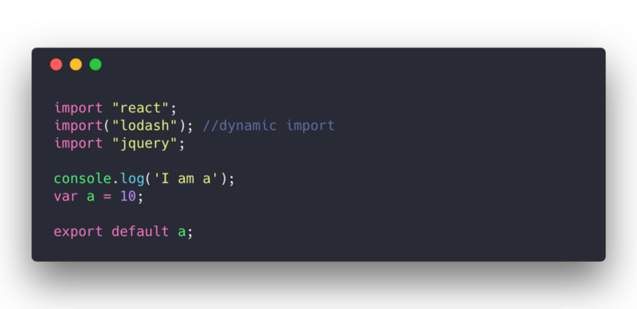
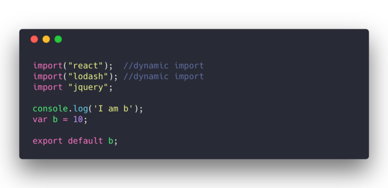
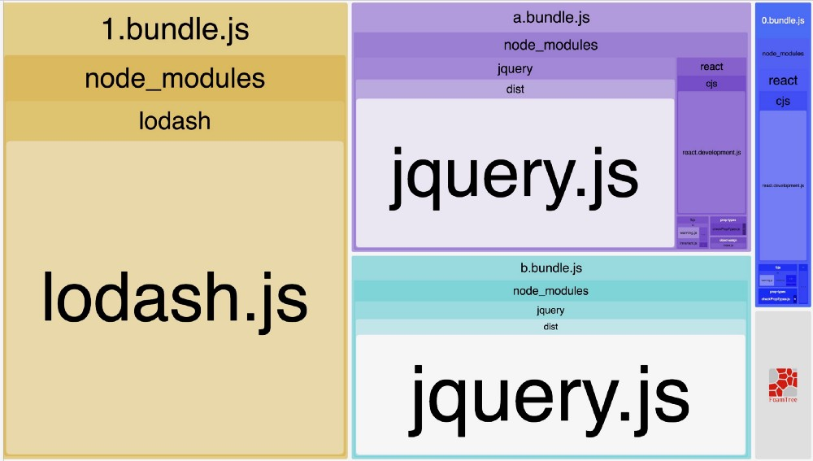
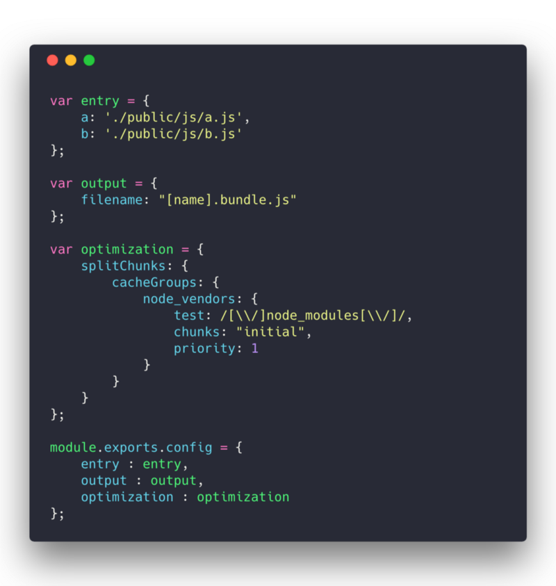
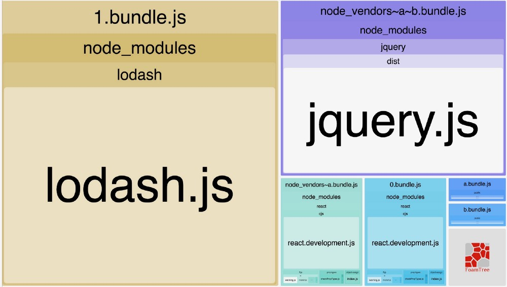
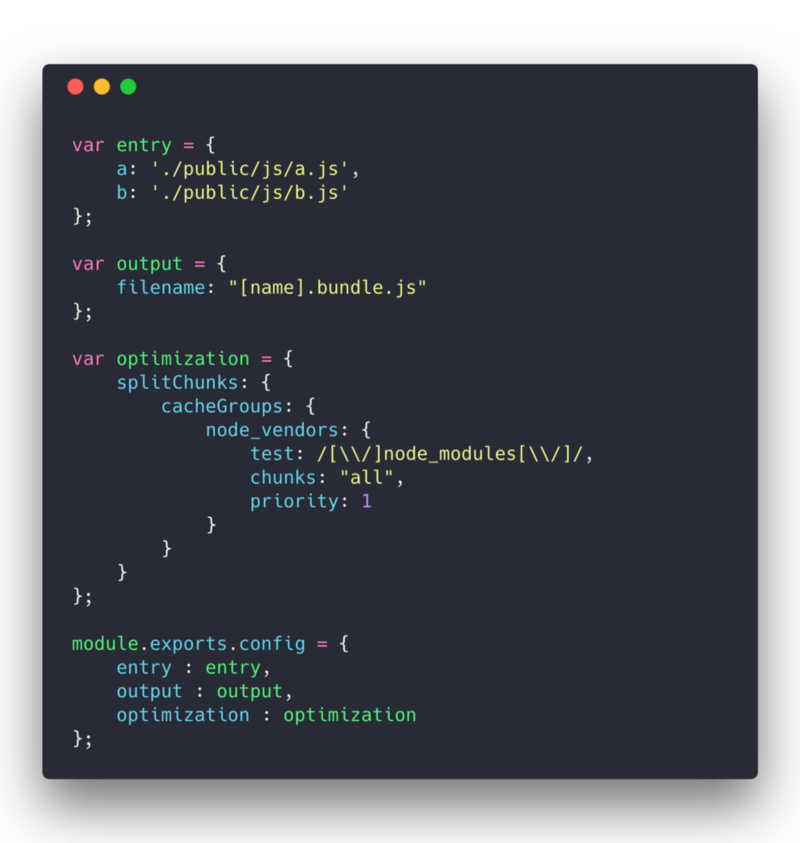
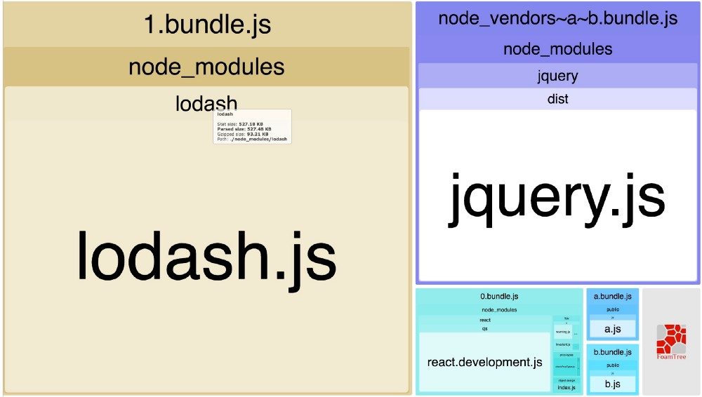

原文链接：[Webpack 4 — Mysterious SplitChunks Plugin](https://medium.com/dailyjs/webpack-4-splitchunks-plugin-d9fbbe091fd0)

> 官方发布了 webpack 4，舍弃了之前的 commonChunkPlugin，增加了 SplitChunksPlugin, 对于这个插件，它的 option 选项有‘initial’、'async'、'all'三个值。我想大多数刚学习 webpack 4 的同学都不能很好的理解这几个值的区别，到底每个选项值意味着什么呢，这篇文章为我们详细解释了这几个值的区别。

这是我的一个粗略尝试， 通过一个常见的例子来理解和帮助你使用 SplitChunksPlugin 选项。

作为早期的爱好者，我试图理解代码分割 (Code-Spliting) 背后的魔法。文档说 splitChucnks 接受'initial', 'async', 'all'。我有点困惑，更加提高了我的好奇心。

我深入研究了文档的 Github 历史记录和 WebpackOptions 概要，并发现，

```js
“There are 3 values possible ”initial”, ”async” and ”all”. When configured the optimization only selects initial chunks, on-demand chunks or all chunks.” — Github History

“Select chunks for determining shared modules (defaults to “async”, “initial” and “all” requires adding these chunks to the HTML) ”

— WebpackOptions Schema
```

这里的想法是有 a.js 和 b.js 两个入口文件，然后引用相同的 node_modules。 其中的一些 module 会被动态引入，用来检验代码分割(Code-Spliting)的行为。

我们使用 [Webpack Bundle Analyzer Plugin](https://github.com/webpack-contrib/webpack-bundle-analyzer) 来帮助我们理解我们的 node_modules 是如何被分割的。

## a.js:

只有 lodash 是动态引入的



## b.js:



我选这样的配置的主要原因是为了理解当存在公共库时，Webpack 配置的表现是如何的

1.  在一个入口文件动态引入，另一个则不 - React
2.  在两个入口文件都动态引入 - lodash
3.  在两个入口文件中都不动态引入 - jquery

我们将保持这些文件不变，并通过 chunks 的值来更改 webpack 的配置。

## 1. chunks : “async” — Optimization over async module




chunks: 'async' 告诉 webpack

”hey， webpack！我只关心动态导入的模块的优化。你可以保留非动态模块“

现在，让我们一步一步看看发生了什么

- webpack 会从 b.js 提取出 react，并移动到一个新文件，但保持 a.js 中的 react 不动。这个优化只会作用到动态模块，**import('react')** 声明会产生独立的文件，**import 'react'** 则不会
- webpack 从 a.js 中提取 lodash，并移动到一个新文件，该文件也被 b.js 引用了
- 这里不会对**jquery** 进行优化，尽管 a.js 和 b.js 都引用了

## 2. chunks : “initial” — Optimization over Sync Module




chunks: 'initial' 告诉 webpack

”hey， webpack！我不关心动态引入的模块，你可以为每一个  模块分别创建文件。 但是，我希望将所有非动态引入的模块放在一个 bundle 中，尽管它们还需要引入其他的非动态引入的木块，我准备与其他文件共享和分块我的非动态导入模块“

现在，让我们一步一步看看发生了什么

- a.js 中的 react 会被移动到**node_vendors~a.bundle.js**, b.js 中的 react 会被移动到**0.bundle.js**
- a.js 和 b.js 中的 lodash 会被移动到**1.bundle.js**。为什么？这是一个动态引入的模块
- jquery 是一个非动态导入的公共模块，会移动到 node_vendors~a~b.bundle.js，被 a.js 和 b.js 共享

## 3. chunks : ‘all’ — Optimization over Async and Sync Module





chunks: 'all' 告诉 webpack

”hey， webpack！我不关心这是一个动态还是非动态引入的模块。都对它们进行优化。 但要确保......你足够聪明这样做“

现在，让我们一步一步看看发生了什么

- react 在 a.js 中是非动态引入的模块，在 b.js 中是动态引入的。因此，它转到单个文件 0.bundle.js，它将由两者引用。
- lodash 在两个文件中都是动态引入的，所以它显然得到一个单独的文件**1.bundle.js**
- jquery 是非动态导入的，因此它转到公共共享模块 node_vendors~a~b.bundle.js，并将由两者引用。

> 第一次翻译，有很多不到位的地方，欢迎指正。
